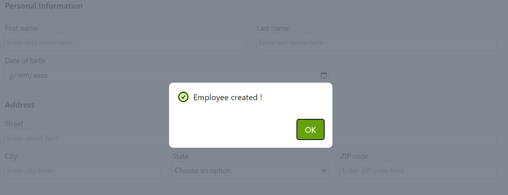

# React plugin : react-custom-accessible-modal



A React responsive modal component that handles accessibility requirements :

- use of Escape key to close the modal
- traps focus inside the modal
- hides background content
- focus on whatever field you want when the modal is closed (optional)

You can also choose to apply your own custom style for the button, the icon and message

## Features

React > v.18.2.0  
Node.js > v.16.17.1

## Install

Once you have set up your React app :

`npm install react-custom-accessible-modal`

## Use

- **Import the plugin in your React app :**

```bash
  import { Modal } from "react-custom-accessible-modal";
```

- **Set the state and variables in the component where the plugin is imported (e.g.):**

```bash
  import { useState } from "react";

  const [showModal, setShowModal] = useState(false);

  const myIcon = "iconName";
  const myMessage = "Profile created successfully !";
  const myButtonText = "OK";
  const myAriaLabel = "OK, close modal";
  const closeModal = () => setShowModal(false);
  const myButtonStyle = { backgroundColor: "#0891b2" };
  const myIconStyle = { borderRadius: "30px" };
  const myMessageStyle = { fontSize: "45px" };
```

- **Pass an event to open the modal in your component :**

```bash
const openModal = (e) => {
    e.preventDefault();
    setShowModal(true);
  };
```

- **Return the modal plugin in your JSX with conditional rendering :**

```bash
{showModal && (
<Modal icon={myIcon} message={myMessage} buttonText={myButtonText} ariaLabel={myAriaLabel} closeModal={closeModal} buttonStyle={myButtonStyle} iconStyle={myIconStyle} messageStyle={myMessageStyle}
/>)}
```

## Optional feature

Set focus on a specific element when the modal is closed :

- **Set the useRef hook to target the element that will receive the focus in your component (e.g.) :**

```bash
  import { useRef } from "react";

  const inputRef = useRef(null);

  <input ref={inputRef} />
```

- **Replace the closeModal variable we have set up above by this one :**

```bash
  const closeModal = () => {
    setShowModal(false);
    inputRef.current.focus();
  };
```

## Props

| Parameter      | Type     | Description                                                                                                |
| :------------- | :------- | :--------------------------------------------------------------------------------------------------------- |
| `icon`         | `object` | icon                                                                                                       |
| `message`      | `string` | message confirming that the action was successfully performed                                              |
| `buttonText`   | `string` | text displayed inside the button                                                                           |
| `ariaLabel`    | `string` | label aiming to help users of assistive technologies, especially if buttonText value is not quite explicit |
| `closeModal`   | `string` | fired when the user clicks on the button                                                                   |
| `buttonStyle`  | `string` | change the button styling by passing the properties directly to the prop                                   |
| `iconStyle`    | `string` | change the icon styling by passing the properties directly to the prop                                     |
| `messageStyle` | `string` | change the message styling by passing the properties directly to the prop                                  |

## Demo

Here are 2 examples of how to use the plugin to give feedback to the user after a form submission.

- With focus : when the user gets back to the page, the focus is placed on a specific element

```bash
import { useState, useRef } from "react";
import { Modal } from "react-custom-accessible-modal";

export default function MyComponent() {
  //  Define state and variables
  const [showModal, setShowModal] = useState(false);
  const myIcon = "iconName";
  const myMessage = "Profile created successfully !";
  const myButtonText = "OK";
  const myAriaLabel = "OK, close modal";
  const myButtonStyle = { backgroundColor: "#0891b2" };
  const myIconStyle = { borderRadius: "30px" };
  const myMessageStyle = { fontSize: "45px" };
  const openModal = (e) => {
    e.preventDefault();
    setShowModal(true);
  };

  // Put focus on a specific element when modal is closed
  const inputRef = useRef(null);
  const closeModal = () => {
    setShowModal(false);
    inputRef.current.focus();
  };

  return (
    //Pass the onClick or onSubmit event that opens the modal
    <form onSubmit={openModal}>
      <input />
      <input ref={inputRef} />
      <button type="submit">Save</button>
      {/* The modal is conditionally rendered */}
      {showModal && (
        <Modal
          icon={myIcon}
          message={myMessage}
          buttonText={myButtonText}
          ariaLabel={myAriaLabel}
          closeModal={closeModal}
          buttonStyle={myButtonStyle}
          iconStyle={myIconStyle}
          messageStyle={myMessageStyle}
        />
      )}
    </form>
  );
};
```

- Without focus

```bash
import { useState } from "react";
import { Modal } from "react-custom-accessible-modal";

export default function MyComponent() {
  // Define state and variables
  const [showModal, setShowModal] = useState(false);

  const myIcon = "iconName";
  const myMessage = "Profile created successfully !";
  const myButtonText = "OK";
  const myAriaLabel = "OK, close modal";
  const closeModal = () => setShowModal(false);
  const myButtonStyle = { backgroundColor: "#0891b2" };
  const myIconStyle = { borderRadius: "30px" };
  const myMessageStyle = { fontSize: "45px" };

  const openModal = (e) => {
    e.preventDefault();
    setShowModal(true);
  };

  return (
    //Pass the onClick or onSubmit event that opens the modal
    <form onSubmit={openModal}>
      <button type="submit">Save</button>

      {/* The modal is conditionally rendered */}
      {showModal && (
        <Modal
          icon={myIcon}
          message={myMessage}
          buttonText={myButtonText}
          ariaLabel={myAriaLabel}
          closeModal={closeModal}
          buttonStyle={myButtonStyle}
          iconStyle={myIconStyle}
          messageStyle={myMessageStyle}
        />
      )}
    </form>
  );
};
```
