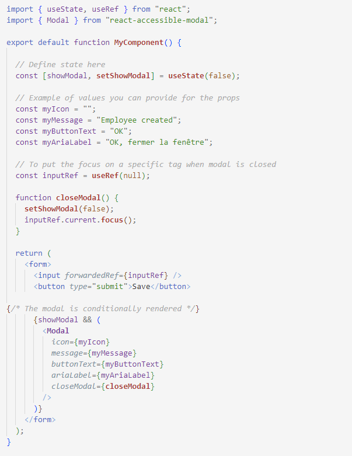
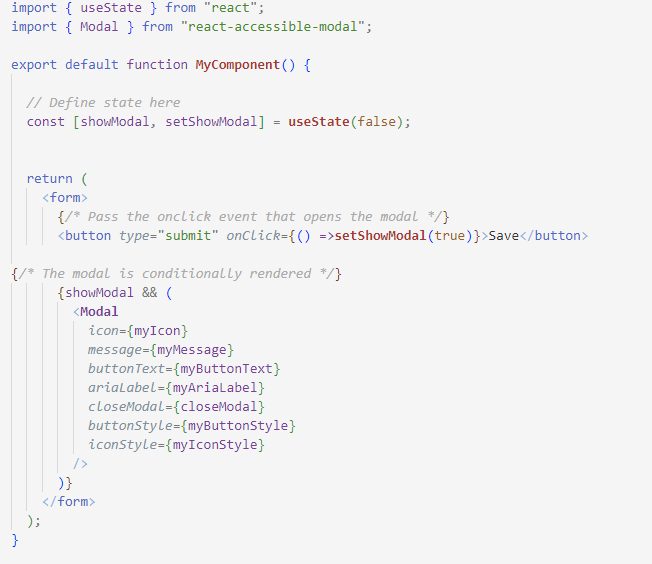

<h1>React plugin : react-accessible-modal</h1>
 

A React responsive modal component that handles accessibility requirements :
-	use of Escape key to close the modal
-	traps focus inside the modal
-	hides background content
-	focus on whatever field you want when the mdal is closed (optional)
 

<h2>Install</h2>
Once you have set up your React app :
 
 
<code>npm install react-accessible-modal</code>
 
 

<h2>Use</h2>
<ol>
<li>Import the component in your React app :</li>
<code>import { Modal } from "react-accessible-modal";</code>
  
  
 <li>Set the state :</li>
<code>const [showModal, setShowModal] = useState(false);</code>
 
  
<li>Return the component in your JSX:</li>
<code>Modal icon={myIcon} message={myMessage} buttonText={myButtonText} ariaLabel={myAriaLabel} closeModal={closeModal}/></code>

You can choose to use the version which allows you to put the focus on a specific tag when you close the modal or use a more basic version.</ol>

Here are 2 examples of how to use the plugin to give feedback to the user after a form submission. 
 
 
-	With focus : when the user gets back to the page, the focus is placed on a specific element (input)
 

 
-	Without focus
 
 

 

<h2>Props</h2>
 

<table>
  <thead>
    <tr>
      <th>Name</th>
     <th>Type</th>
     <th>Description</th>
    </tr>
  </thead>
  <tbody>
    <tr>
      <td><code>icon</code></td>
      <td>string</td>
     <td>icon</td>
    </tr>
   <tr>
      <td><code>message</code></td>
      <td>string</td>
     <td>message confirming that the action was successfully performed</td>
    </tr>
   <tr>
      <td><code>buttonText</code></td>
      <td>string</td>
     <td>text displayed inside the button</td>
    </tr>
   <tr>
      <td><code>ariaLabel</code></td>
      <td>string</td>
     <td>label aiming to help users of assistive technologies, especially if buttonText value is not quite explicit</td>
    </tr>
   <tr>
      <td><code>closeModal</code></td>
      <td>function</td>
     <td>fired when the user clicks on the button</td>
    </tr>
  </tbody>
</table>

